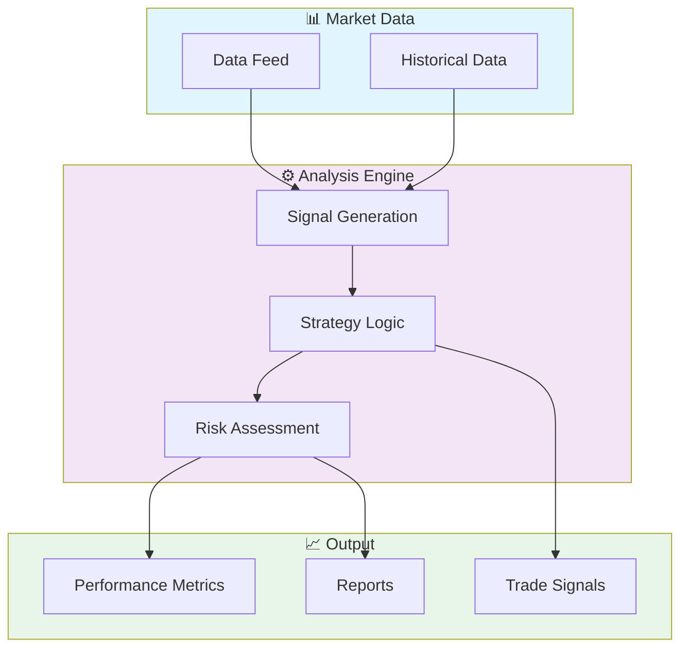

# 📈 Sql Trading Database Design

> Professional SQL project implementing Sql Trading Database Design

[](https://img.shields.io/badge/)
[](LICENSE)

[English](#english) | [Português](#português)

---

## English

### 🎯 Overview

**Sql Trading Database Design** is a production-grade SQL application complemented by Shell that showcases modern software engineering practices including clean architecture, comprehensive testing, containerized deployment, and CI/CD readiness.

The codebase comprises **4,824 lines** of source code organized across **20 modules**, following industry best practices for maintainability, scalability, and code quality.

### ✨ Key Features

- **📈 Strategy Engine**: Multiple trading strategy implementations with configurable parameters
- **🔄 Backtesting Framework**: Historical data simulation with realistic market conditions
- **📊 Performance Analytics**: Sharpe ratio, Sortino ratio, maximum drawdown, and more
- **⚡ Real-time Processing**: Low-latency data processing optimized for market speed
- **🔄 Data Pipeline**: Scalable ETL with parallel processing
- **✅ Data Validation**: Schema validation and quality checks
- **📊 Monitoring**: Pipeline health metrics and alerting
- **🔧 Configurability**: YAML/JSON-based pipeline configuration

### 🏗️ Architecture



### 🚀 Quick Start

#### Prerequisites

- PostgreSQL 15+ or compatible database
- dbt (if using dbt models)

#### Installation

```bash
git clone https://github.com/galafis/sql-trading-database-design.git
cd sql-trading-database-design
```

### 🧪 Testing

Run the test suite to verify everything works correctly.

### 📁 Project Structure

```
sql-trading-database-design/
├── docs/          # Documentation
│   ├── CONTRIBUTING.md
│   ├── FAQ.md
│   ├── USE_CASES.md
│   ├── backup_recovery.md
│   ├── data_dictionary.md
│   ├── erd.md
│   ├── monitoring.md
│   └── query_optimization.md
├── functions/
│   ├── pnl_functions.sql
│   └── position_functions.sql
├── migrations/
│   └── README.md
├── procedures/
│   ├── order_execution.sql
│   └── settlement.sql
├── queries/
│   ├── analytics/
│   │   └── top_performers.sql
│   ├── monitoring/
│   │   └── database_health.sql
│   └── reports/
│       └── daily_reports.sql
├── schema/
│   ├── 01_core_tables.sql
│   ├── 02_trading_tables.sql
│   └── 03_market_data.sql
├── tests/         # Test suite
│   ├── load/
│   │   └── place_orders.sql
│   ├── performance/
│   │   └── benchmark_orders.sql
│   └── unit/
│       ├── test_pnl_functions.sql
│       └── test_schema.sql
├── triggers/
│   ├── audit_triggers.sql
│   └── validation_triggers.sql
├── views/
│   ├── pnl_view.sql
│   ├── portfolio_view.sql
│   └── risk_view.sql
├── AUDIT_SUMMARY.md
├── BADGE_FIX_SUMMARY.md
├── CHANGELOG.md
├── CI_FIX_SUMMARY.md
├── FIX_SUMMARY.md
├── LICENSE
├── README.md
├── TEST_FIX_SUMMARY.md
└── test_runner.sh
```

### 📊 Performance Metrics

The engine calculates comprehensive performance metrics:

| Metric | Description | Formula |
|--------|-------------|---------|
| **Sharpe Ratio** | Risk-adjusted return | (Rp - Rf) / σp |
| **Sortino Ratio** | Downside risk-adjusted return | (Rp - Rf) / σd |
| **Max Drawdown** | Maximum peak-to-trough decline | max(1 - Pt/Pmax) |
| **Win Rate** | Percentage of profitable trades | Wins / Total |
| **Profit Factor** | Gross profit / Gross loss | ΣProfit / ΣLoss |
| **Calmar Ratio** | Return / Max Drawdown | CAGR / MDD |
| **VaR (95%)** | Value at Risk | 5th percentile of returns |
| **Expected Shortfall** | Conditional VaR | E[R | R < VaR] |

### 🛠️ Tech Stack

| Technology | Description | Role |
|------------|-------------|------|
| **SQL** | Core Language | Primary |
| Shell | 1 files | Supporting |

### 🤝 Contributing

Contributions are welcome! Please feel free to submit a Pull Request. For major changes, please open an issue first to discuss what you would like to change.

1. Fork the project
2. Create your feature branch (`git checkout -b feature/AmazingFeature`)
3. Commit your changes (`git commit -m 'Add some AmazingFeature'`)
4. Push to the branch (`git push origin feature/AmazingFeature`)
5. Open a Pull Request

### 📄 License

This project is licensed under the MIT License - see the [LICENSE](LICENSE) file for details.

### 👤 Author

**Gabriel Demetrios Lafis**
- GitHub: [@galafis](https://github.com/galafis)
- LinkedIn: [Gabriel Demetrios Lafis](https://linkedin.com/in/gabriel-demetrios-lafis)

---

## Português

### 🎯 Visão Geral

**Sql Trading Database Design** é uma aplicação SQL de nível profissional, complementada por Shell que demonstra práticas modernas de engenharia de software, incluindo arquitetura limpa, testes abrangentes, implantação containerizada e prontidão para CI/CD.

A base de código compreende **4,824 linhas** de código-fonte organizadas em **20 módulos**, seguindo as melhores práticas do setor para manutenibilidade, escalabilidade e qualidade de código.

### ✨ Funcionalidades Principais

- **📈 Strategy Engine**: Multiple trading strategy implementations with configurable parameters
- **🔄 Backtesting Framework**: Historical data simulation with realistic market conditions
- **📊 Performance Analytics**: Sharpe ratio, Sortino ratio, maximum drawdown, and more
- **⚡ Real-time Processing**: Low-latency data processing optimized for market speed
- **🔄 Data Pipeline**: Scalable ETL with parallel processing
- **✅ Data Validation**: Schema validation and quality checks
- **📊 Monitoring**: Pipeline health metrics and alerting
- **🔧 Configurability**: YAML/JSON-based pipeline configuration

### 🏗️ Arquitetura


### 🚀 Início Rápido

#### Prerequisites

- PostgreSQL 15+ or compatible database
- dbt (if using dbt models)

#### Installation

```bash
git clone https://github.com/galafis/sql-trading-database-design.git
cd sql-trading-database-design
```

### 🧪 Testing

Run the test suite to verify everything works correctly.

### 📁 Estrutura do Projeto

```
sql-trading-database-design/
├── docs/          # Documentation
│   ├── CONTRIBUTING.md
│   ├── FAQ.md
│   ├── USE_CASES.md
│   ├── backup_recovery.md
│   ├── data_dictionary.md
│   ├── erd.md
│   ├── monitoring.md
│   └── query_optimization.md
├── functions/
│   ├── pnl_functions.sql
│   └── position_functions.sql
├── migrations/
│   └── README.md
├── procedures/
│   ├── order_execution.sql
│   └── settlement.sql
├── queries/
│   ├── analytics/
│   │   └── top_performers.sql
│   ├── monitoring/
│   │   └── database_health.sql
│   └── reports/
│       └── daily_reports.sql
├── schema/
│   ├── 01_core_tables.sql
│   ├── 02_trading_tables.sql
│   └── 03_market_data.sql
├── tests/         # Test suite
│   ├── load/
│   │   └── place_orders.sql
│   ├── performance/
│   │   └── benchmark_orders.sql
│   └── unit/
│       ├── test_pnl_functions.sql
│       └── test_schema.sql
├── triggers/
│   ├── audit_triggers.sql
│   └── validation_triggers.sql
├── views/
│   ├── pnl_view.sql
│   ├── portfolio_view.sql
│   └── risk_view.sql
├── AUDIT_SUMMARY.md
├── BADGE_FIX_SUMMARY.md
├── CHANGELOG.md
├── CI_FIX_SUMMARY.md
├── FIX_SUMMARY.md
├── LICENSE
├── README.md
├── TEST_FIX_SUMMARY.md
└── test_runner.sh
```

### 📊 Performance Metrics

The engine calculates comprehensive performance metrics:

| Metric | Description | Formula |
|--------|-------------|---------|
| **Sharpe Ratio** | Risk-adjusted return | (Rp - Rf) / σp |
| **Sortino Ratio** | Downside risk-adjusted return | (Rp - Rf) / σd |
| **Max Drawdown** | Maximum peak-to-trough decline | max(1 - Pt/Pmax) |
| **Win Rate** | Percentage of profitable trades | Wins / Total |
| **Profit Factor** | Gross profit / Gross loss | ΣProfit / ΣLoss |
| **Calmar Ratio** | Return / Max Drawdown | CAGR / MDD |
| **VaR (95%)** | Value at Risk | 5th percentile of returns |
| **Expected Shortfall** | Conditional VaR | E[R | R < VaR] |

### 🛠️ Stack Tecnológica

| Tecnologia | Descrição | Papel |
|------------|-----------|-------|
| **SQL** | Core Language | Primary |
| Shell | 1 files | Supporting |

### 🤝 Contribuindo

Contribuições são bem-vindas! Sinta-se à vontade para enviar um Pull Request.

### 📄 Licença

Este projeto está licenciado sob a Licença MIT - veja o arquivo [LICENSE](LICENSE) para detalhes.

### 👤 Autor

**Gabriel Demetrios Lafis**
- GitHub: [@galafis](https://github.com/galafis)
- LinkedIn: [Gabriel Demetrios Lafis](https://linkedin.com/in/gabriel-demetrios-lafis)
