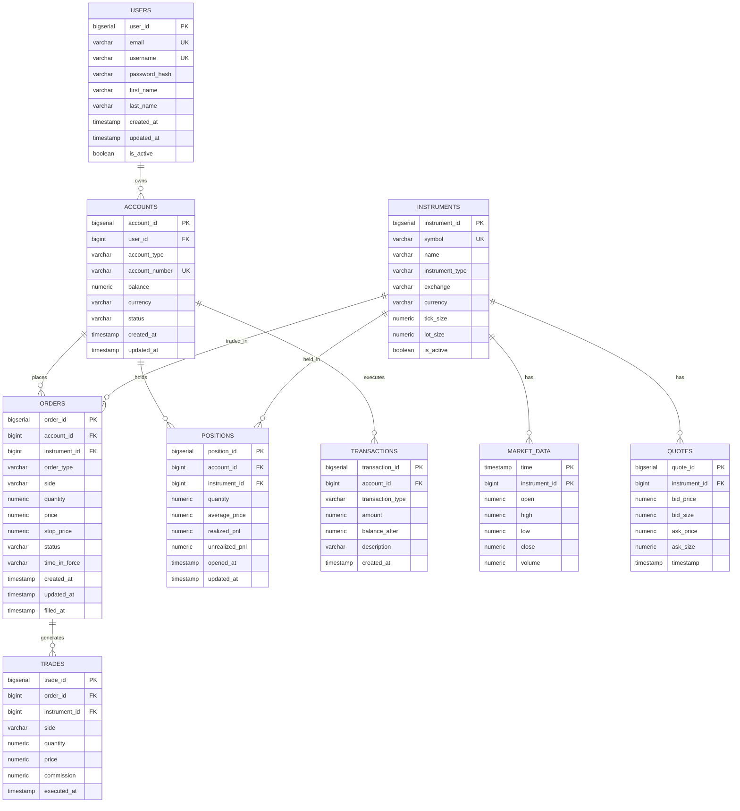
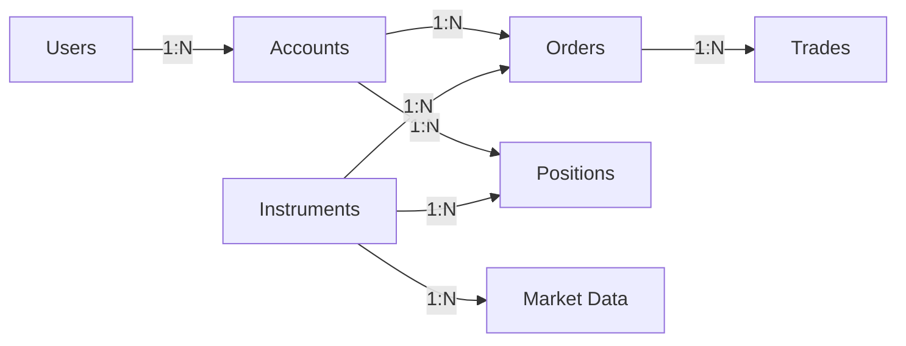
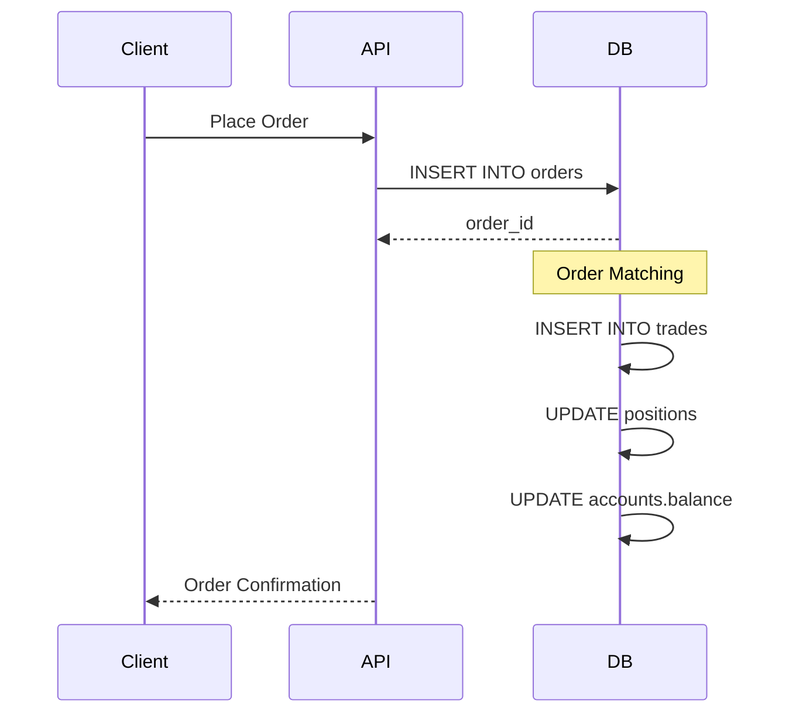

# 📊 Entity Relationship Diagram

## Complete Database Schema



## Core Tables

### Users Table
```sql
CREATE TABLE users (
    user_id BIGSERIAL PRIMARY KEY,
    email VARCHAR(255) UNIQUE NOT NULL,
    username VARCHAR(100) UNIQUE NOT NULL,
    password_hash VARCHAR(255) NOT NULL,
    first_name VARCHAR(100),
    last_name VARCHAR(100),
    created_at TIMESTAMP DEFAULT CURRENT_TIMESTAMP,
    updated_at TIMESTAMP DEFAULT CURRENT_TIMESTAMP,
    is_active BOOLEAN DEFAULT true
);
```

### Accounts Table
```sql
CREATE TABLE accounts (
    account_id BIGSERIAL PRIMARY KEY,
    user_id BIGINT REFERENCES users(user_id),
    account_type VARCHAR(50) NOT NULL,
    account_number VARCHAR(50) UNIQUE NOT NULL,
    balance NUMERIC(20, 2) DEFAULT 0,
    currency VARCHAR(3) DEFAULT 'USD',
    status VARCHAR(20) DEFAULT 'active',
    created_at TIMESTAMP DEFAULT CURRENT_TIMESTAMP,
    updated_at TIMESTAMP DEFAULT CURRENT_TIMESTAMP
);
```

### Instruments Table
```sql
CREATE TABLE instruments (
    instrument_id BIGSERIAL PRIMARY KEY,
    symbol VARCHAR(20) UNIQUE NOT NULL,
    name VARCHAR(255) NOT NULL,
    instrument_type VARCHAR(50) NOT NULL,
    exchange VARCHAR(50),
    currency VARCHAR(3) DEFAULT 'USD',
    tick_size NUMERIC(10, 4),
    lot_size NUMERIC(10, 2),
    is_active BOOLEAN DEFAULT true
);
```

## Trading Tables

### Orders Table
```sql
CREATE TABLE orders (
    order_id BIGSERIAL PRIMARY KEY,
    account_id BIGINT REFERENCES accounts(account_id),
    instrument_id BIGINT REFERENCES instruments(instrument_id),
    order_type VARCHAR(20) NOT NULL,
    side VARCHAR(10) NOT NULL,
    quantity NUMERIC(20, 8) NOT NULL,
    price NUMERIC(20, 8),
    stop_price NUMERIC(20, 8),
    status VARCHAR(20) DEFAULT 'pending',
    time_in_force VARCHAR(10) DEFAULT 'GTC',
    created_at TIMESTAMP DEFAULT CURRENT_TIMESTAMP,
    updated_at TIMESTAMP DEFAULT CURRENT_TIMESTAMP,
    filled_at TIMESTAMP
);
```

### Trades Table
```sql
CREATE TABLE trades (
    trade_id BIGSERIAL PRIMARY KEY,
    order_id BIGINT REFERENCES orders(order_id),
    instrument_id BIGINT REFERENCES instruments(instrument_id),
    side VARCHAR(10) NOT NULL,
    quantity NUMERIC(20, 8) NOT NULL,
    price NUMERIC(20, 8) NOT NULL,
    commission NUMERIC(20, 8) DEFAULT 0,
    executed_at TIMESTAMP DEFAULT CURRENT_TIMESTAMP
);
```

### Positions Table
```sql
CREATE TABLE positions (
    position_id BIGSERIAL PRIMARY KEY,
    account_id BIGINT REFERENCES accounts(account_id),
    instrument_id BIGINT REFERENCES instruments(instrument_id),
    quantity NUMERIC(20, 8) NOT NULL,
    average_price NUMERIC(20, 8) NOT NULL,
    realized_pnl NUMERIC(20, 2) DEFAULT 0,
    unrealized_pnl NUMERIC(20, 2) DEFAULT 0,
    opened_at TIMESTAMP DEFAULT CURRENT_TIMESTAMP,
    updated_at TIMESTAMP DEFAULT CURRENT_TIMESTAMP,
    UNIQUE(account_id, instrument_id)
);
```

## Market Data Tables (TimescaleDB)

### Market Data (OHLCV)
```sql
CREATE TABLE market_data (
    time TIMESTAMP NOT NULL,
    instrument_id BIGINT NOT NULL,
    open NUMERIC(20, 8) NOT NULL,
    high NUMERIC(20, 8) NOT NULL,
    low NUMERIC(20, 8) NOT NULL,
    close NUMERIC(20, 8) NOT NULL,
    volume NUMERIC(20, 2) NOT NULL,
    PRIMARY KEY (time, instrument_id)
);

-- Convert to hypertable for time-series optimization
SELECT create_hypertable('market_data', 'time');
```

### Quotes Table
```sql
CREATE TABLE quotes (
    quote_id BIGSERIAL PRIMARY KEY,
    instrument_id BIGINT REFERENCES instruments(instrument_id),
    bid_price NUMERIC(20, 8) NOT NULL,
    bid_size NUMERIC(20, 2) NOT NULL,
    ask_price NUMERIC(20, 8) NOT NULL,
    ask_size NUMERIC(20, 2) NOT NULL,
    timestamp TIMESTAMP DEFAULT CURRENT_TIMESTAMP
);
```

## Relationships

### One-to-Many Relationships



### Key Constraints

| Table | Foreign Key | References |
|-------|-------------|------------|
| accounts | user_id | users(user_id) |
| orders | account_id | accounts(account_id) |
| orders | instrument_id | instruments(instrument_id) |
| trades | order_id | orders(order_id) |
| trades | instrument_id | instruments(instrument_id) |
| positions | account_id | accounts(account_id) |
| positions | instrument_id | instruments(instrument_id) |
| quotes | instrument_id | instruments(instrument_id) |

## Indexes

### Performance Indexes
```sql
-- Orders
CREATE INDEX idx_orders_account ON orders(account_id);
CREATE INDEX idx_orders_instrument ON orders(instrument_id);
CREATE INDEX idx_orders_status ON orders(status);
CREATE INDEX idx_orders_created ON orders(created_at DESC);

-- Trades
CREATE INDEX idx_trades_order ON trades(order_id);
CREATE INDEX idx_trades_instrument ON trades(instrument_id);
CREATE INDEX idx_trades_executed ON trades(executed_at DESC);

-- Positions
CREATE INDEX idx_positions_account ON positions(account_id);
CREATE INDEX idx_positions_instrument ON positions(instrument_id);

-- Market Data
CREATE INDEX idx_market_data_instrument ON market_data(instrument_id, time DESC);

-- Quotes
CREATE INDEX idx_quotes_instrument ON quotes(instrument_id, timestamp DESC);
```

## Stored Procedures

### Place Order
```sql
CREATE OR REPLACE FUNCTION place_order(
    p_account_id BIGINT,
    p_instrument_id BIGINT,
    p_order_type VARCHAR,
    p_side VARCHAR,
    p_quantity NUMERIC,
    p_price NUMERIC DEFAULT NULL
) RETURNS BIGINT AS $$
DECLARE
    v_order_id BIGINT;
BEGIN
    INSERT INTO orders (
        account_id, instrument_id, order_type, 
        side, quantity, price, status
    ) VALUES (
        p_account_id, p_instrument_id, p_order_type,
        p_side, p_quantity, p_price, 'pending'
    ) RETURNING order_id INTO v_order_id;
    
    RETURN v_order_id;
END;
$$ LANGUAGE plpgsql;
```

### Calculate Position P&L
```sql
CREATE OR REPLACE FUNCTION calculate_position_pnl(
    p_position_id BIGINT,
    p_current_price NUMERIC
) RETURNS NUMERIC AS $$
DECLARE
    v_quantity NUMERIC;
    v_avg_price NUMERIC;
    v_unrealized_pnl NUMERIC;
BEGIN
    SELECT quantity, average_price
    INTO v_quantity, v_avg_price
    FROM positions
    WHERE position_id = p_position_id;
    
    v_unrealized_pnl := v_quantity * (p_current_price - v_avg_price);
    
    UPDATE positions
    SET unrealized_pnl = v_unrealized_pnl,
        updated_at = CURRENT_TIMESTAMP
    WHERE position_id = p_position_id;
    
    RETURN v_unrealized_pnl;
END;
$$ LANGUAGE plpgsql;
```

## Views

### Portfolio View
```sql
CREATE VIEW portfolio_view AS
SELECT 
    a.account_id,
    a.account_number,
    u.username,
    i.symbol,
    p.quantity,
    p.average_price,
    p.unrealized_pnl,
    p.realized_pnl,
    (p.quantity * p.average_price) as position_value
FROM positions p
JOIN accounts a ON p.account_id = a.account_id
JOIN users u ON a.user_id = u.user_id
JOIN instruments i ON p.instrument_id = i.instrument_id
WHERE p.quantity != 0;
```

## Data Flow



## Backup Strategy

### Full Backup (Daily)
```bash
pg_dump -Fc trading_db > backup_$(date +%Y%m%d).dump
```

### Incremental Backup (Hourly)
```bash
pg_basebackup -D /backup/incremental -Ft -z -P
```

### Point-in-Time Recovery
```bash
# Enable WAL archiving
archive_mode = on
archive_command = 'cp %p /archive/%f'
```
